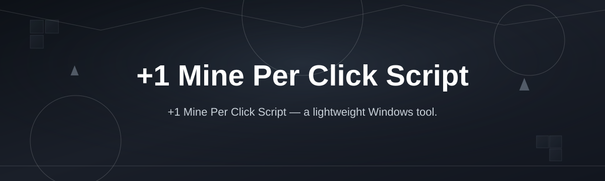
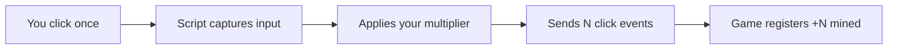

# mine-per-click-booster

*A +1 Mine Per Click Script for people whose clicking finger got tired of doing all the work.*

Before you read a single paragraph of my rambling, here's the short version:

1. Open the landing page and grab the latest build.
2. Unzip it, run the `.exe`, no install wizard nonsense.
3. Press start, click your mining tool once, watch the counter jump.

That's it. Everything below is just me explaining why this thing exists and what it actually does.

## What this is

`mine-per-click-booster` is a +1 Mine Per Click Script built for clicker-style and idle mining games where your click count is the entire game loop. Instead of hammering your mouse button until your wrist files a complaint, the script listens for a single click and applies a controlled +1 (or a multiplier you set) on top of it — turning one physical click into the click output the game actually registers. No memory editing, no game-file rewriting, no touching anything under the hood of the game itself.

I built this because I was three prestige layers deep into a mining clicker and realized my actual bottleneck wasn't strategy, it was my finger. This script exists to fix that specific, extremely relatable problem: games that reward repetition more than decision-making. It's a standalone Windows tool — one executable, no background services, no telemetry phoning home while you mine pretend rocks.

  

That button opens the project's download page, which is where the current build actually lives.

## Who it is for

1. **Idle/mining clicker players** who want their click output to keep up with late-game scaling without buying a second mouse.
2. **Players with hand or wrist strain** who still want to progress in click-based games without physically overclicking.
3. **Streamers and content creators** demoing mining-clicker games who need consistent, repeatable click output for clean footage.
4. **Tinkerers** who like small, single-purpose Windows utilities instead of bloated all-in-one game suites.
5. **Anyone testing UI responsiveness** in a click-driven game they're building, since the script is a decent stress source too.

## What you can do

1. **Turn one click into N clicks** — set your own per-click multiplier instead of being stuck at a flat +1.
2. **Toggle on/off with a hotkey** — no need to alt-tab into the script's window mid-session.
3. **Run it alongside the game window** — it listens system-wide, so it doesn't need to be pinned on top.
4. **Adjust click timing** — add a small delay if a game's click detection gets picky about rapid input.
5. **See a live click counter** — a tiny overlay tells you what's actually being sent, so you're not guessing.
6. **Save your last-used settings** — it remembers your multiplier and hotkey between sessions.
7. **Run it with zero install footprint** — one `.exe`, no registry entries, delete the folder and it's gone.
8. **Use it on any click-based mining or farming clicker**, not just one specific title — it works on input, not game code.

## Getting started

1. Go to the [landing page](https://porttigercove.github.io/mine-per-click-booster/) and download the current build for Windows.
2. Extract the zip anywhere — Desktop, Downloads, a folder you'll forget about, doesn't matter.
3. Launch `MinePerClickBooster.exe`. Windows may show a SmartScreen prompt for unsigned apps — click "More info" → "Run anyway."
4. Set your multiplier and hotkey in the small settings window that opens.
5. Alt-tab back into your game, click once, and check that your mining counter jumped by more than one.

## Requirements

- Windows 10 or Windows 11 (64-bit).
- No Python, no Node, no runtime to install — it's a standalone executable.
- No admin rights required for normal use; some games with anti-cheat overlays may need it run as administrator to register global input correctly.
- A mouse. Obviously.

## How it works

The script doesn't touch the target game's files or memory. It sits between your physical click and the game window, intercepting the single mouse-down event and re-emitting it as your configured number of click events, spaced by a tiny delay so the game's input handler doesn't drop them as a double-click.

1. You click your mouse once, inside or over the game window.
2. The script's hook catches that single click event.
3. It multiplies it based on your saved settings (default: +1, adjustable up).
4. It replays the clicks with a small internal delay so nothing gets merged or ignored.
5. The game sees normal click input, just more of it, and updates your mining count.

## FAQ

**Is this a mod that changes the game files?**
No. It doesn't read, write, or patch anything belonging to the game. It works purely on input events at the operating system level, which is also why it isn't tied to one specific title.

**Will using a click booster get my account flagged or banned?**
That depends entirely on the game and its rules around automated or assisted input — some clicker games explicitly allow this kind of tool, others don't. Read your game's terms before using it competitively or on an account you care about.

**Does it work on macOS or Linux?**
Not currently. It's built and tested specifically for Windows 10/11. There's no roadmap commitment for other platforms yet.

**Do I need Python, Node, or any dependency installed first?**
No. It ships as a single Windows executable. If you're being asked to install a runtime or toolchain to run it, you've got the wrong download.

**Can I use this on more than one mining clicker game at the same time?**
The script isn't game-specific — it works on any window receiving click input — but running it against two games simultaneously is untested and probably a bad idea for your sanity, not just the software.

## Troubleshooting

1. **Windows SmartScreen blocks the app** — this happens with unsigned executables; click "More info" then "Run anyway" to launch it.
2. **Clicks aren't registering in-game** — try running the script as administrator; some games render through overlays that block unprivileged input hooks.
3. **Counter overlay doesn't show** — check it isn't hidden behind the game window; it's set to stay on top by default but some fullscreen exclusive modes override that.
4. **Multiplier resets after restart** — make sure the app has write access to its own folder; it saves settings to a local config file next to the executable.

## License

Released under the [MIT License](LICENSE). Use it, modify it, fork it — just don't hold me responsible for how your favorite mining clicker's terms of service feel about automated clicks. Check the game's own rules before you use this on an account that matters to you.

  

